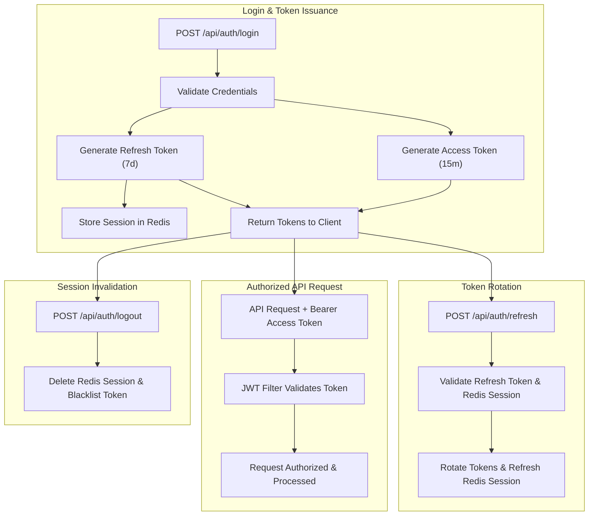

# 🔗 URL Shortener Backend (Spring Boot 3.5.4)

[](https://www.oracle.com/java/)
[](https://spring.io/projects/spring-boot)
[](https://spring.io/projects/spring-security)
[](https://www.postgresql.org/)
[](https://redis.io/)
[](https://www.docker.com/)
[](http://localhost:8080/swagger-ui.html)
[](https://maven.apache.org/)

A production-ready, highly available RESTful URL Shortener backend service built with **Java 21**, **Spring Boot 3.5.4**, **Spring Security 6**, **PostgreSQL 16**, **Redis 7**, **JWT Authentication**, **Maven**, **Lombok**, **Brevo Email Service**, and **OpenAPI/Swagger**.

---

## 🌟 Key Features

### 🔐 Authentication & Session Management
- **Stateless JWT Tokens**: Short-lived access tokens (15 minutes) and long-lived refresh tokens (7 days).
- **Redis Session Management**: State management for refresh tokens stored in Redis with full token rotation support.
- **Session Control**: Supports logging out single sessions or revoking all sessions across devices (`logout-all`).
- **Account Endpoints**: Email-based registration, login, and user profile (`/api/auth/me`).
- **Google OAuth 2.0**: Seamless social login integration with automatic account matching by email.

### 🌐 URL Management & Real-Time Analytics
- **Full CRUD Operations**: Create, read, update, delete, and list owner-scoped URLs.
- **Pagination & Search**: List URLs with dynamic pagination, sorting, and search filtering.
- **Fast Redirection**: High-performance HTTP 302 redirect lookup using unique short codes.
- **Rich Analytics**: Tracks total click counts, last access timestamps, device OS, browser user-agents, client IP addresses, and daily click rollups.
- **JPA Auditing**: Automatic creation and update timestamps (`createdAt`, `updatedAt`).
- **GeoIP Location**: Automatic geolocation tracking for click analytics using IP-based lookup.

### 📧 Email & OTP Management
- **Brevo Email Service**: Secure email delivery via Brevo REST API (replaces SMTP to bypass port restrictions).
- **Email Verification**: OTP-based account verification with customizable expiration and resend cooldowns.
- **Password Reset**: Secure password reset flow with time-limited authorization tokens.
- **Configurable OTP**: Maximum retry attempts, expiration duration, and resend cooldown settings stored in Redis.

### 🛡️ Resilience & Standards
- **Standardized API Envelope**: All REST responses follow a uniform `ApiResponse<T>` wrapper.
- **Global Error Handling**: Comprehensive validation annotations and centralized exception handler.
- **OpenAPI & Swagger Documentation**: Auto-generated interactive API UI at runtime.
- **Containerization**: Full Docker Compose setup with multi-stage build for PostgreSQL, Redis, and Spring Boot.
- **Actuator Endpoints**: Health checks and application info endpoints for monitoring and deployment automation.

---

## 🏗️ Architecture & Workflows

### Authentication & Token Lifecycle Flow


```mermaid
flowchart TD
    subgraph Login ["Login & Token Issuance"]
        A["POST /api/auth/login"] --> B["Validate Credentials"]
        B --> C["Generate Access Token (15m)"]
        B --> D["Generate Refresh Token (7d)"]
        D --> E["Store Session in Redis"]
        C & D --> F["Return Tokens to Client"]
    end

    subgraph Request ["Authorized API Request"]
        F --> G["API Request + Bearer Access Token"]
        G --> H["JWT Filter Validates Token"]
        H --> I["Request Authorized & Processed"]
    end

    subgraph Refresh ["Token Rotation"]
        F --> J["POST /api/auth/refresh"]
        J --> K["Validate Refresh Token & Redis Session"]
        K --> L["Rotate Tokens & Refresh Redis Session"]
    end

    subgraph Logout ["Session Invalidation"]
        F --> M["POST /api/auth/logout"]
        M --> N["Delete Redis Session & Blacklist Token"]
    end
```

---

## 📁 Directory Structure

```text
url-shorter-sb/
├── src/
│   ├── main/
│   │   ├── java/com/url/shortener/
│   │   │   ├── UrlShorterSbApplication.java      # Spring Boot entry point
│   │   │   ├── config/                           # Configuration beans & security setup
│   │   │   │   ├── AppProperties.java           # Application property bindings
│   │   │   │   ├── AsyncConfig.java             # Async & scheduled task configuration
│   │   │   │   ├── JpaConfig.java               # JPA auditing configuration
│   │   │   │   ├── OpenApiConfig.java           # Swagger/OpenAPI configuration
│   │   │   │   ├── PropertyConfig.java          # Property validation & setup
│   │   │   │   └── RedisConfig.java             # Redis connection & serialization
│   │   │   │
│   │   │   ├── controllers/                     # REST API endpoints
│   │   │   │   ├── AuthController.java          # Auth endpoints (register, login, refresh, etc.)
│   │   │   │   └── UrlMappingController.java    # URL CRUD & redirect endpoints
│   │   │   │
│   │   │   ├── dtos/                            # Data Transfer Objects (Request/Response)
│   │   │   │   ├── ApiResponse.java             # Standard API response wrapper
│   │   │   │   ├── AuthResponse.java            # Authentication response payload
│   │   │   │   ├── CreateShortUrlRequest.java   # Create URL request
│   │   │   │   ├── LoginRequest.java            # Login credentials
│   │   │   │   ├── OtpVerificationRequest.java  # OTP verification payload
│   │   │   │   ├── RegisterRequest.java         # User registration payload
│   │   │   │   ├── ShortUrlResponse.java        # Short URL response
│   │   │   │   ├── UrlAnalyticsResponse.java    # URL analytics payload
│   │   │   │   ├── UpdateUrlRequest.java        # Update URL request
│   │   │   │   ├── UserResponse.java            # User profile response
│   │   │   │   ├── PagedResponse.java           # Pagination wrapper
│   │   │   │   └── ... (other DTOs)
│   │   │   │
│   │   │   ├── exception/                       # Exception handling
│   │   │   │   ├── GlobalExceptionHandler.java  # Centralized error handling & validation
│   │   │   │   ├── BadRequestException.java
│   │   │   │   ├── DuplicateResourceException.java
│   │   │   │   ├── InvalidTokenException.java
│   │   │   │   ├── UnauthorizedException.java
│   │   │   │   ├── UrlNotFoundException.java
│   │   │   │   ├── UserNotFoundException.java
│   │   │   │   └── ServiceUnavailableException.java
│   │   │   │
│   │   │   ├── models/                          # JPA entities & enums
│   │   │   │   ├── BaseEntity.java              # Base entity with UUID & timestamps
│   │   │   │   ├── User.java                    # User entity with credentials & metadata
│   │   │   │   ├── UrlMapping.java              # Short URL entity with click analytics
│   │   │   │   ├── ClickEvent.java              # Individual click record for analytics
│   │   │   │   ├── OtpVerification.java         # OTP state (Redis-backed)
│   │   │   │   ├── RefreshSession.java          # User session state (Redis-backed)
│   │   │   │   ├── Role.java                    # User role enum
│   │   │   │   └── OtpPurpose.java              # OTP type enum (REGISTRATION, RESET, etc.)
│   │   │   │
│   │   │   ├── repo/                            # Data repositories & queries
│   │   │   │   ├── UserRepository.java          # User CRUD & custom queries
│   │   │   │   ├── UrlMappingRepository.java    # URL CRUD with search/filter support
│   │   │   │   ├── ClickEventRepository.java    # Click event storage & aggregations
│   │   │   │   └── OtpVerificationRepository.java # OTP verification queries
│   │   │   │
│   │   │   ├── security/                        # Spring Security & JWT
│   │   │   │   ├── security/
│   │   │   │   │   └── WebSecurityConfig.java   # Spring Security filter chain config
│   │   │   │   ├── JwtAuthenticationFilter.java # JWT token validation filter
│   │   │   │   ├── JwtService.java              # JWT creation, validation & claims extraction
│   │   │   │   ├── RestAuthenticationEntryPoint.java # Unauthorized error responses
│   │   │   │   ├── UserDetailsImpl.java          # Custom UserDetails implementation
│   │   │   │   └── UserDetailsServiceImpl.java   # UserDetailsService implementation
│   │   │   │
│   │   │   ├── service/                         # Business logic layer
│   │   │   │   ├── AuthService.java             # Authentication & registration logic
│   │   │   │   ├── UrlMappingService.java       # URL creation, update, delete logic
│   │   │   │   ├── OtpService.java              # OTP generation, validation, storage (Redis)
│   │   │   │   ├── EmailService.java            # Email delivery via Brevo API
│   │   │   │   ├── GeoLocationService.java      # Geolocation lookup from IP address
│   │   │   │   ├── GeoLocationClient.java       # Geolocation API abstraction
│   │   │   │   ├── IpApiGeoLocationClient.java  # IPApi implementation for GeoIP
│   │   │   │   ├── GoogleOAuthService.java      # Google OAuth 2.0 token validation
│   │   │   │   ├── RedisSessionService.java     # Refresh token & session state management
│   │   │   │   ├── UserService.java             # User CRUD & profile management
│   │   │   │   ├── UserDetailsServiceImpl.java   # Spring Security UserDetailsService
│   │   │   │   ├── ClickAnalyticsEnrichmentListener.java # Event-driven click analytics
│   │   │   │   └── ClickEventRecorded.java      # Click event domain event
│   │   │   │
│   │   │   └── util/                            # Utility classes
│   │   │       ├── ShortCodeGenerator.java      # Base62 short code generation
│   │   │       ├── ClientInfoExtractor.java     # Extract client IP, user-agent, device info
│   │   │       └── ClientInfo.java              # Client metadata DTO
│   │   │
│   │   └── resources/
│   │       ├── application.properties           # Spring configuration (dev & prod settings)
│   │       ├── static/                          # Static assets (CSS, JS, images)
│   │       └── templates/                       # Email templates
│   │           ├── verification-email.html      # Registration OTP email template
│   │           └── password-reset-email.html    # Password reset OTP email template
│   │
│   └── test/
│       ├── java/com/url/shortener/
│       │   ├── controllers/
│       │   │   └── AuthControllerTest.java      # Auth endpoint integration tests
│       │   ├── security/
│       │   │   └── ClientInfoExtractorTest.java # Client info extraction tests
│       │   ├── service/
│       │   │   ├── AuthServiceTest.java         # Authentication logic tests
│       │   │   ├── AuthSecurityIntegrationTest.java # Security integration tests
│       │   │   ├── GeoLocationServiceTest.java  # Geolocation service tests
│       │   │   ├── OtpServiceTest.java          # OTP generation & validation tests
│       │   │   └── UrlMappingServiceIntegrationTest.java # URL service integration tests
│       │   └── UrlShorterSbApplicationTests.java # Application context tests
│       └── resources/
│           └── application.properties           # Test configuration (H2 in-memory DB)
│
├── docs/
│   ├── database-schema.md                       # Complete ERD and database table specifications
│   └── postman/
│       └── url-shortener.postman_collection.json # Postman API collection for testing
│
├── .env.example                                 # Environment variable template
├── .gitignore                                   # Git ignore rules
├── Dockerfile                                   # Multi-stage Docker build (Maven + JRE)
├── docker-compose.yml                           # Docker Compose: PostgreSQL + Redis + Spring Boot
├── pom.xml                                      # Maven project configuration & dependencies
├── mvnw & mvnw.cmd                              # Maven wrapper for CI/CD
├── HELP.md                                      # Maven-generated help documentation
└── README.md                                    # This file
```

---

## 🚀 Getting Started

### Prerequisites

Ensure you have the following installed on your local environment:
- **Java 21 JDK** or higher
- **Docker** and **Docker Compose**
- **Maven** (or use the included `./mvnw` wrapper)

---

### 1️⃣ Clone & Configure Environment

Duplicate `.env.example` or create a `.env` file in the project root:

```bash
cp .env.example .env
```

---

### 2️⃣ Run via Docker Compose (Recommended)

To build and run the Spring Boot app alongside PostgreSQL and Redis in containers:

```bash
docker compose up --build -d
```

The application will start on **`http://localhost:8080`**.

To stop the containers:
```bash
docker compose down
```

---

### 3️⃣ Run Locally with Maven

If you prefer running the Spring Boot application locally while starting PostgreSQL & Redis in Docker:

1. **Start database and cache services**:
   ```bash
   docker compose up -d postgres redis
   ```

2. **Compile and build the package**:
   ```bash
   ./mvnw clean package
   ```

3. **Run the Spring Boot app**:
   ```bash
   ./mvnw spring-boot:run
   ```

---

## ⚙️ Environment Variables

| Variable | Description | Default |
|---|---|---|
| `SERVER_PORT` | HTTP port for the Spring Boot application | `8081` (local), `8080` (Docker) |
| `DB_URL` | PostgreSQL JDBC Connection String | `jdbc:postgresql://localhost:5433/url_shortener` |
| `DB_USERNAME` | PostgreSQL database user | `postgres` |
| `DB_PASSWORD` | PostgreSQL database password | `postgres` |
| `DB_NAME` | PostgreSQL database name | `url_shortener` |
| `JPA_DDL_AUTO` | Hibernate schema mode; use `validate` for an existing production database | `update` |
| `REDIS_HOST` | Hostname for Redis instance | `localhost` |
| `REDIS_PORT` | Port for Redis instance | `6379` |
| `REDIS_USERNAME` | Redis authentication username | *(optional)* |
| `REDIS_PASSWORD` | Access password for Redis instance | *(empty)* |
| `REDIS_SSL_ENABLED` | Enable TLS for a managed Redis service | `false` |
| `APP_BASE_URL` | Base domain/URL used to generate shortened links | `http://localhost:8080` |
| `APP_CORS_ALLOWED_ORIGINS` | Comma-separated list of allowed CORS origins | `http://localhost:3000,http://localhost:8080` |
| `JWT_SECRET` | Base64-encoded secret key for signing JWTs | *(Required in Production)* |
| `GOOGLE_CLIENT_ID` | Google OAuth web-client ID | *(Required for Google sign-in)* |
| `GOOGLE_CLIENT_SECRET` | Google OAuth web-client secret | *(Required for Google sign-in)* |
| `GOOGLE_REDIRECT_URI` | Exact backend OAuth callback registered at Google | `http://localhost:8080/api/auth/google/callback` |
| `FRONTEND_URL` | Trusted frontend origin used after OAuth completes | `http://localhost:3000` |
| `BREVO_API_KEY` | Brevo transactional email API key | *(Required for email delivery)* |
| `MAIL_FROM_ADDRESS` | Sender email address for Brevo emails | *(Required for email delivery)* |
| `MAIL_SENDER_NAME` | Display name for email sender | `Nexly` |
| `MAIL_HOST` | SMTP host (legacy, not used with Brevo API) | `smtp.gmail.com` |
| `MAIL_PORT` | SMTP port (legacy, not used with Brevo API) | `587` |
| `MAIL_USERNAME` | SMTP username (legacy, not used with Brevo API) | *(empty)* |
| `MAIL_APP_PASSWORD` | SMTP app password (legacy, not used with Brevo API) | *(empty)* |
| `OTP_EXPIRATION` | OTP validity duration (ISO 8601 format) | `PT10M` (10 minutes) |
| `OTP_RESET_AUTHORIZATION_EXPIRATION` | Password-reset authorization validity | `PT15M` (15 minutes) |
| `OTP_RESEND_COOLDOWN` | Minimum wait before requesting another OTP | `PT60S` (60 seconds) |
| `OTP_MAX_ATTEMPTS` | Maximum invalid OTP attempts before lockout | `5` |

### Email Delivery Setup (Brevo)

**Brevo** provides secure transactional email delivery via REST API, eliminating the need for SMTP configuration and avoiding port restrictions (common on Render free tier).

1. **Sign up** for a free Brevo account at [brevo.com](https://www.brevo.com)
2. **Get your API key** from the [API settings page](https://app.brevo.com/settings/keys/api)
3. **Configure in `.env`**:
   ```bash
   BREVO_API_KEY=your_api_key_here
   MAIL_FROM_ADDRESS=your-email@example.com
   ```
4. **No SMTP secrets required** — the application uses Brevo REST API internally.

### Redis Persistence

The application stores the following data in Redis with automatic expiration:
- **Refresh sessions** — Active JWT refresh tokens with session metadata
- **OTP verifications** — Time-limited OTP codes for registration and password reset
- **Password reset authorizations** — One-time tokens for secure password changes

All Redis data is configured to expire automatically per the `*_EXPIRATION` settings, ensuring no stale data accumulates.

### Render.com Deployment Setup

For deploying to [Render.com](https://render.com):

1. **Create a PostgreSQL Database**
   - In Render dashboard, create a new PostgreSQL database
   - Copy the connection string to `DB_URL`
   - Set `JPA_DDL_AUTO=validate` to avoid schema migrations on every boot

2. **Create a Redis Instance**
   - Create a Key Value Store (Redis)
   - Copy `REDIS_HOST`, `REDIS_PORT`, and `REDIS_PASSWORD` from the Connect tab
   - Set `REDIS_SSL_ENABLED=false` for internal endpoint or `true` for TLS endpoint

3. **Deploy Backend Web Service**
   - Connect your GitHub repository
   - Build command: `./mvnw clean package`
   - Start command: `java -jar target/url-shorter-sb-0.0.1-SNAPSHOT.jar`
   - Set all environment variables in the Render dashboard

4. **Google OAuth for Production**
   - Register authorized redirect URI: `https://your-render-api.onrender.com/api/auth/google/callback`
   - Set `FRONTEND_URL` to your frontend domain
   - Add frontend URL to `APP_CORS_ALLOWED_ORIGINS`

---

## 🧪 Testing

The project includes comprehensive unit and integration tests using **JUnit 5**, **Mockito**, and **Spring Test**:

```bash
# Run all tests
./mvnw test

# Run specific test class
./mvnw test -Dtest=AuthServiceTest

# Run with test coverage report
./mvnw clean test
```

**Test Suites:**
- **AuthControllerTest** — Authentication endpoint integration tests
- **AuthServiceTest** — Login, registration, and token refresh logic
- **AuthSecurityIntegrationTest** — Spring Security integration tests
- **GeoLocationServiceTest** — IP-based geolocation service
- **OtpServiceTest** — OTP generation, validation, and Redis storage
- **UrlMappingServiceIntegrationTest** — URL CRUD and analytics operations
- **ClientInfoExtractorTest** — Client metadata extraction utilities

Test configuration uses an **H2 in-memory database** for fast, isolated test execution with automatic cleanup between test runs.

---

## 📖 API Documentation & Testing

### Interactive Swagger UI & OpenAPI

When the service is running, interactively test API endpoints directly in your browser:

- 🌐 **Swagger UI**: [http://localhost:8080/swagger-ui.html](http://localhost:8080/swagger-ui.html)
- 📄 **OpenAPI Specification (JSON)**: [http://localhost:8080/api-docs](http://localhost:8080/api-docs)

### Postman Collection

An updated Postman collection is included in the project for seamless API testing:

- 📬 [docs/postman/url-shortener.postman_collection.json](docs/postman/url-shortener.postman_collection.json)

---

## 📡 REST API Endpoint Summary

### 🔑 Authentication Endpoints (`/api/auth`)

| Method | Endpoint | Description | Auth |
|---|---|---|---|
| `POST` | `/api/auth/register` | Register and send an email-verification OTP | 🔓 Public |
| `POST` | `/api/auth/verify-registration-otp` | Verify registration OTP and issue JWT tokens | 🔓 Public |
| `POST` | `/api/auth/resend-otp` | Resend an account-verification OTP | 🔓 Public |
| `POST` | `/api/auth/forgot-password` | Request a password-reset OTP (enumeration-safe) | 🔓 Public |
| `POST` | `/api/auth/verify-reset-otp` | Verify a password-reset OTP and obtain a reset authorization | 🔓 Public |
| `POST` | `/api/auth/reset-password` | Set a new password using one-time reset authorization | 🔓 Public |
| `POST` | `/api/auth/login` | Authenticate user and issue JWT access/refresh tokens | 🔓 Public |
| `POST` | `/api/auth/refresh` | Obtain a new access token using a valid refresh token | 🔓 Public |
| `POST` | `/api/auth/logout` | Revoke current refresh token session | 🔒 Bearer |
| `POST` | `/api/auth/logout-all` | Revoke all active sessions across all devices | 🔒 Bearer |
| `GET` | `/api/auth/me` | Retrieve profile information for the current user | 🔒 Bearer |

### 🔗 URL Endpoints (`/api/url`)

| Method | Endpoint | Description | Auth |
|---|---|---|---|
| `POST` | `/api/url` | Create a shortened URL from a original URL | 🔒 Bearer |
| `GET` | `/api/url/{id}` | Retrieve URL details and analytics by URL UUID | 🔒 Bearer |
| `PUT` | `/api/url/{id}` | Update original destination URL or active status | 🔒 Bearer |
| `DELETE` | `/api/url/{id}` | Delete a shortened URL | 🔒 Bearer |
| `GET` | `/api/url/my` | Paginated listing of user's URLs with search filter | 🔒 Bearer |
| `GET` | `/{shortCode}` | Public redirect endpoint to destination URL | 🔓 Public |

---

### 📦 Standardized API Response Format

All responses follow a consistent `ApiResponse<T>` envelope structure:

```json
{
  "success": true,
  "message": "Short URL created successfully",
  "data": {
    "id": "d290f1ee-6c54-4b01-90e6-d701748f0851",
    "shortCode": "Ab12Cd34",
    "shortUrl": "http://localhost:8080/Ab12Cd34",
    "originalUrl": "https://google.com",
    "clickCount": 0,
    "createdAt": "2026-07-24T09:00:00Z",
    "updatedAt": "2026-07-24T09:00:00Z",
    "expirationDate": null,
    "lastAccessedAt": null,
    "active": true
  },
  "timestamp": "2026-07-24T09:00:00Z"
}
```

---

## 🗄️ Database Schema

For detailed database table definitions, foreign key constraints, and index details:
- 📖 See [docs/database-schema.md](docs/database-schema.md)

---

## 🚀 Roadmap & Future Enhancements

- [ ] **Advanced Analytics Dashboard** — Location heatmaps, referrer tracking, device breakdowns.
- [ ] **Rate Limiting** — Per-user and per-IP rate limits on auth and redirect endpoints using Redis.
- [ ] **Database Migrations** — Structured schema migrations using Flyway or Liquibase.
- [ ] **Distributed Tracing** — OpenTelemetry integration for request tracing across services.
- [ ] **Metrics & Monitoring** — Prometheus metrics and Grafana dashboards for application health.
- [ ] **Batch Operations** — Bulk URL creation, deletion, and analytics export.
- [ ] **Custom Short Codes** — Allow users to specify vanity short codes with admin approval.
- [ ] **URL Expiration Scheduling** — Automatic URL deactivation after a configurable period.
- [ ] **Link Preview & Social Media Cards** — Open Graph and Twitter Card metadata injection.

---

## 📚 Technology Stack Summary

| Layer | Technology | Version |
|-------|-----------|---------|
| **Runtime** | Java | 21 LTS |
| **Framework** | Spring Boot | 3.5.4 |
| **Security** | Spring Security 6 + JWT (JJWT) | 6.x / 0.12.7 |
| **Database** | PostgreSQL | 16 (Alpine) |
| **Cache/Session** | Redis | 7 (Alpine) |
| **API Docs** | SpringDoc OpenAPI (Swagger) | 2.8.9 |
| **Build Tool** | Maven | 3.9.8 |
| **Email Service** | Brevo REST API | Latest |
| **OAuth 2.0** | Google OAuth 2.0 | Latest |
| **Testing** | JUnit 5 + Mockito + Spring Test | Latest |
| **Containerization** | Docker + Docker Compose | Latest |
| **Code Generation** | Lombok | Latest |

---

## 🎯 Project Highlights

✅ **Production-Ready** — Stateless JWT auth with Redis session management  
✅ **Secure** — Spring Security 6, CORS, HTTPS-ready OAuth 2.0  
✅ **Scalable** — Redis for caching and session state, PostgreSQL for persistence  
✅ **Well-Tested** — Integration tests for auth, services, and API endpoints  
✅ **Documented** — OpenAPI/Swagger UI, detailed database schema, Postman collection  
✅ **Cloud-Ready** — Multi-stage Docker build, Render.com deployment guides  
✅ **Developer-Friendly** — Lombok for reduced boilerplate, clean architecture layers  

---

## 📞 Support & Contribution

For issues, feature requests, or contributions, please open a GitHub issue or submit a pull request.

**License**: This project is provided as-is for educational and commercial use.
